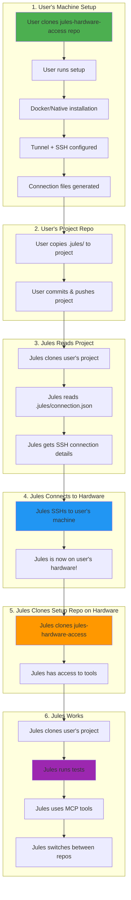

# 🔄 Complete Workflow - How Jules Actually Uses Your Hardware

**The full picture: From setup to Jules running tests on your hardware**

---

## 🎯 The Complete Flow



---

## 📍 Where Everything Lives

### On User's Local Machine:
```
~/
├── jules-hardware-access/          ← Setup repo (cloned by user)
│   ├── docker/                     ← Docker setup
│   ├── setup.py                    ← Setup script
│   ├── status.py                   ← Monitoring
│   ├── configs/                    ← User's configs (NOT committed)
│   └── generated_files/            ← Generated files (NOT committed)
│
└── projects/
    └── my-app/                     ← User's project repo
        ├── src/
        ├── .jules/                 ← Copied from generated_files/
        └── AGENTS.md               ← Copied from generated_files/
```

### On GitHub:
```
github.com/user/my-app/             ← User's project (public/private)
├── src/
├── .jules/                         ← Connection info (committed)
│   ├── connection.json
│   └── ssh_config
└── AGENTS.md                       ← Capabilities (committed)

github.com/you/jules-hardware-access ← Setup repo (public)
├── docker/
├── setup.py
└── [tools and docs]
```

### On User's Hardware (After Jules Connects):
```
/home/jules/                        ← Jules user home directory
├── jules-hardware-access/          ← Cloned by Jules
│   ├── enhanced_mcp_hardware_server.py
│   ├── tunnel_manager.py
│   └── [tools]
│
└── workspace/
    └── my-app/                     ← User's project cloned by Jules
        ├── src/
        ├── tests/
        └── .jules/
```

---

## 🔄 Step-by-Step: What Actually Happens

### Phase 1: User Setup (One Time)

**Step 1: User clones setup repo**
```bash
# On user's local machine
cd ~
git clone https://github.com/you/jules-hardware-access.git
cd jules-hardware-access
```

**Step 2: User runs setup**
```bash
python setup.py
# Chooses Docker (recommended)
# Setup creates tunnel + SSH
# Files generated in: generated_files/docker/
```

**Step 3: User copies files to their project**
```bash
cd ~/projects/my-app
cp -r ~/jules-hardware-access/generated_files/docker/.jules .
cp ~/jules-hardware-access/generated_files/docker/AGENTS.md .
```

**Step 4: User commits their project**
```bash
git add .jules/ AGENTS.md
git commit -m "Add Jules hardware access"
git push
```

---

### Phase 2: Jules Discovers Hardware

**Step 1: Jules clones user's project**
```bash
# Jules (on Jules' infrastructure)
git clone https://github.com/user/my-app.git
cd my-app
```

**Step 2: Jules reads connection info**
```bash
# Jules reads: .jules/connection.json
{
  "ssh_hostname": "abc123.trycloudflare.com",
  "username": "jules",
  "ssh_key_path": "~/.ssh/jules_hardware_key",
  "capabilities": ["gpu", "docker", "build"]
}
```

**Step 3: Jules reads AGENTS.md**
```markdown
# Hardware Capabilities
- GPU: NVIDIA RTX 3090
- RAM: 64GB
- Storage: 2TB NVMe
- Docker: Available
```

---

### Phase 3: Jules Connects to Hardware

**Step 1: Jules establishes SSH connection**
```bash
# Jules runs (on Jules' infrastructure)
ssh -i ~/.ssh/jules_hardware_key jules@abc123.trycloudflare.com
```

**Step 2: Jules is now on user's hardware**
```bash
# Jules is now in: /home/jules/
# Jules has sudo access
# Jules can run any command
```

---

### Phase 4: Jules Sets Up Workspace

**Step 1: Jules clones setup repo (for tools)**
```bash
# Jules runs on user's hardware
cd /home/jules
git clone https://github.com/you/jules-hardware-access.git
cd jules-hardware-access
```

**Why?** Jules needs access to:
- MCP server (`enhanced_mcp_hardware_server.py`)
- Tunnel manager (`tunnel_manager.py`)
- Status monitoring (`status.py`)
- Other utilities

**Step 2: Jules clones user's project (for work)**
```bash
# Jules runs on user's hardware
cd /home/jules/workspace
git clone https://github.com/user/my-app.git
cd my-app
```

**Step 3: Jules starts MCP server**
```bash
# Jules runs on user's hardware
cd /home/jules/jules-hardware-access
python enhanced_mcp_hardware_server.py
```

---

### Phase 5: Jules Works on Project

**Step 1: Jules runs tests**
```bash
# Jules is in: /home/jules/workspace/my-app
npm install
npm test

# Or
pip install -r requirements.txt
pytest
```

**Step 2: Jules uses MCP tools**
```python
# Jules uses MCP server to:
# - Check hardware status
# - Monitor GPU usage
# - Switch between repos
# - Run diagnostics
```

**Step 3: Jules switches between repos**
```bash
# Jules can work on multiple repos:
cd /home/jules/workspace/my-app        # User's project
cd /home/jules/jules-hardware-access   # Tools repo
cd /home/jules/workspace/another-app   # Another project
```

---

## 🔧 MCP Server Enhancements Needed

### Current Limitations:
1. ❌ No repo switching capability
2. ❌ No workspace management
3. ❌ No multi-project support

### Required Enhancements:

#### 1. Repo Switching
```python
# MCP tool: switch_repo
{
  "name": "switch_repo",
  "description": "Switch working directory to different repository",
  "parameters": {
    "repo_path": "/home/jules/workspace/my-app"
  }
}
```

#### 2. Workspace Management
```python
# MCP tool: list_workspaces
{
  "name": "list_workspaces",
  "description": "List all cloned repositories in workspace",
  "returns": [
    "/home/jules/workspace/my-app",
    "/home/jules/workspace/another-app",
    "/home/jules/jules-hardware-access"
  ]
}
```

#### 3. Clone Repository
```python
# MCP tool: clone_repo
{
  "name": "clone_repo",
  "description": "Clone a repository to workspace",
  "parameters": {
    "repo_url": "https://github.com/user/repo.git",
    "destination": "/home/jules/workspace/repo"
  }
}
```

---

## 📋 What Gets Committed Where

### Setup Repo (jules-hardware-access)

**✅ Committed:**
- Setup scripts (`setup.py`, `status.py`)
- Docker files (`docker/Dockerfile`, `docker-compose.yml`)
- Documentation (all `.md` files)
- MCP server (`enhanced_mcp_hardware_server.py`)
- Tunnel manager (`tunnel_manager.py`)
- Templates (`templates/`)

**❌ NOT Committed:**
- `configs/` - User's configurations
- `generated_files/` - Generated connection files
- `logs/` - Log files
- `.env` files - Sensitive credentials
- `*.key`, `*.pem` - SSH keys

---

### User's Project Repo (my-app)

**✅ Committed:**
- `.jules/connection.json` - Connection details (no secrets!)
- `.jules/ssh_config` - SSH configuration
- `AGENTS.md` - Hardware capabilities
- User's code (`src/`, `tests/`, etc.)

**❌ NOT Committed:**
- SSH private keys (Jules has these separately)
- Tunnel credentials (in connection.json, not raw tokens)
- User's local configs

---

## 🔐 Security Model

### What's in connection.json (Safe to Commit):
```json
{
  "ssh_hostname": "abc123.trycloudflare.com",
  "username": "jules",
  "port": 22,
  "capabilities": ["gpu", "docker"],
  "hardware_name": "GPU Workstation"
}
```

**Note:** No private keys, no tokens, just connection details!

### What Jules Has Separately (NOT in repo):
- SSH private key (Jules manages this securely)
- Tunnel tokens (on user's hardware only)
- User credentials (never shared)

---

## 🎯 Multiple Projects, Same Hardware

### Scenario: User has 3 projects, 1 hardware

**Setup once:**
```bash
cd ~/jules-hardware-access
python setup.py
# Files in: generated_files/docker/
```

**Copy to all projects:**
```bash
./copy-to-project.sh ~/projects/project1
./copy-to-project.sh ~/projects/project2
./copy-to-project.sh ~/projects/project3
```

**Jules workflow:**
```bash
# Project 1
git clone github.com/user/project1
cd project1
# Reads .jules/connection.json
ssh jules@abc123.trycloudflare.com
# Works on project1

# Project 2
git clone github.com/user/project2
cd project2
# Reads .jules/connection.json (same hardware!)
ssh jules@abc123.trycloudflare.com
# Works on project2

# Same hardware, different projects!
```

---

## 🖥️ Multiple Hardware, One Project

### Scenario: User has 1 project, 3 machines

**Setup on each machine:**
```bash
# Machine 1 (Laptop)
cd ~/jules-hardware-access
python setup.py --hardware-name "Laptop"
# Files in: generated_files/docker/

# Machine 2 (GPU Server)
cd ~/jules-hardware-access
python setup.py --hardware-name "GPU-Server"
# Files in: generated_files/docker/

# Machine 3 (Cloud VM)
cd ~/jules-hardware-access
python setup.py --hardware-name "Cloud-VM"
# Files in: generated_files/docker/
```

**Copy all to project:**
```bash
cd ~/projects/my-app
mkdir -p .jules

# Copy with different names
cp machine1-files/.jules/connection.json .jules/laptop.json
cp machine2-files/.jules/connection.json .jules/gpu-server.json
cp machine3-files/.jules/connection.json .jules/cloud-vm.json

git add .jules/
git commit -m "Add multiple hardware options"
git push
```

**Jules workflow:**
```bash
# Jules reads all connection files
ls .jules/
# laptop.json
# gpu-server.json
# cloud-vm.json

# Jules chooses based on task
# For ML training:
ssh jules@gpu-server-hostname.com

# For quick tests:
ssh jules@laptop-hostname.com

# For production:
ssh jules@cloud-vm-hostname.com
```

---

## 🔄 Complete Lifecycle

### 1. Initial Setup (User)
```
User's Machine → Setup → Generate Files → Copy to Project → Push
```

### 2. Jules Discovery (Jules)
```
Clone Project → Read .jules/ → Get Connection Info
```

### 3. Jules Connection (Jules)
```
SSH to Hardware → Now on User's Machine
```

### 4. Jules Workspace Setup (Jules on User's Hardware)
```
Clone Setup Repo → Clone Project → Start MCP Server
```

### 5. Jules Work (Jules on User's Hardware)
```
Run Tests → Use Tools → Report Results
```

### 6. Monitoring (User)
```
python status.py --watch → See Jules Activity
```

---

## 💡 Key Insights

### 1. Two Repos, Two Purposes
- **Setup repo** = Tools (stays local + on hardware)
- **Project repo** = Code + connection info (on GitHub)

### 2. Jules Clones Both
- **Project repo** = To read connection info
- **Setup repo** = To access tools (on hardware)

### 3. No Secrets in Git
- Connection files have hostnames, not credentials
- SSH keys managed separately by Jules
- Tunnel tokens stay on user's hardware

### 4. Flexible Architecture
- One hardware → Many projects ✅
- Many hardware → One project ✅
- Many hardware → Many projects ✅

### 5. MCP Server is Key
- Runs on user's hardware
- Provides tools to Jules
- Needs repo switching capability

---

## 🚀 Next Steps for MCP Enhancement

### Required Features:
1. **Workspace Management**
   - List cloned repos
   - Switch between repos
   - Clone new repos

2. **Multi-Project Support**
   - Track current working directory
   - Maintain context per project
   - Switch contexts seamlessly

3. **Status Reporting**
   - Report current repo
   - Report available repos
   - Report hardware status

---

**This is the complete workflow!** Now you understand how everything fits together. 🎉
