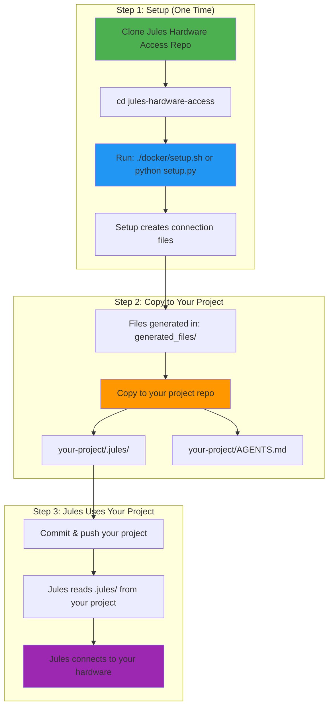

# 🔄 How It Works - Two Repos Explained

**Understanding the two repositories involved**

---

## 📦 The Two Repositories

### 1️⃣ This Repo (Jules Hardware Access Setup)
**Repository:** `let-agents-use-your-pc` (or whatever you named it)

**Purpose:** Setup tools and scripts

**What's in it:**
- Setup scripts (Docker & Native)
- Tunnel management
- Configuration tools
- Status monitoring
- Documentation

**You use this repo to:**
- Run setup once
- Generate connection files
- Monitor status
- Troubleshoot issues

**Location:** Anywhere on your machine (e.g., `~/jules-hardware-access/`)

---

### 2️⃣ Your Project Repo (Any Repo)
**Repository:** Your actual project (e.g., `my-awesome-app`)

**Purpose:** Your code that Jules will work on

**What gets added:**
- `.jules/` folder with connection config
- `AGENTS.md` file with capabilities

**Jules reads from:**
- This repo to know how to connect to your hardware

**Location:** Anywhere (e.g., `~/projects/my-awesome-app/`)

---

## 🔄 The Complete Flow



---

## 📁 Directory Structure Example

### Your Machine:
```
~/
├── jules-hardware-access/          ← THIS REPO (setup tools)
│   ├── docker/
│   │   ├── setup.sh
│   │   └── docker-compose.yml
│   ├── setup.py
│   ├── status.py
│   ├── generated_files/            ← Generated connection files
│   │   ├── docker/
│   │   │   ├── .jules/
│   │   │   └── AGENTS.md
│   │   └── native/
│   │       ├── .jules/
│   │       └── AGENTS.md
│   └── configs/
│
└── projects/
    └── my-awesome-app/             ← YOUR PROJECT REPO
        ├── src/
        ├── tests/
        ├── .jules/                 ← Copied from generated_files/
        │   ├── connection.json
        │   └── ssh_config
        ├── AGENTS.md               ← Copied from generated_files/
        └── README.md
```

---

## 🎯 Step-by-Step Example

### Step 1: Clone Setup Repo (One Time)
```bash
cd ~
git clone https://github.com/you/jules-hardware-access.git
cd jules-hardware-access
```

### Step 2: Run Setup (One Time per Machine)
```bash
# Docker setup (recommended)
cd docker
./setup.sh

# Or native setup
python setup.py
```

**Result:** Connection files generated in `generated_files/`

---

### Step 3: Copy Files to Your Project
```bash
# Go to your project
cd ~/projects/my-awesome-app

# Copy connection files
cp -r ~/jules-hardware-access/generated_files/docker/.jules .
cp ~/jules-hardware-access/generated_files/docker/AGENTS.md .

# Or if you used native:
# cp -r ~/jules-hardware-access/generated_files/native/.jules .
# cp ~/jules-hardware-access/generated_files/native/AGENTS.md .
```

---

### Step 4: Commit to Your Project
```bash
cd ~/projects/my-awesome-app

git add .jules/ AGENTS.md
git commit -m "Add Jules hardware access"
git push
```

---

### Step 5: Jules Uses Your Project
When Jules works on your project:
1. Jules clones `my-awesome-app` from GitHub
2. Jules reads `.jules/connection.json`
3. Jules connects to your hardware via SSH
4. Jules can now run commands, tests, etc.

---

## 🔄 Multiple Projects, Same Hardware

You can use the same hardware for multiple projects:

```bash
# Setup once
cd ~/jules-hardware-access
./docker/setup.sh

# Copy to Project 1
cd ~/projects/project-1
cp -r ~/jules-hardware-access/generated_files/docker/.jules .
cp ~/jules-hardware-access/generated_files/docker/AGENTS.md .
git add .jules/ AGENTS.md && git commit -m "Add Jules" && git push

# Copy to Project 2
cd ~/projects/project-2
cp -r ~/jules-hardware-access/generated_files/docker/.jules .
cp ~/jules-hardware-access/generated_files/docker/AGENTS.md .
git add .jules/ AGENTS.md && git commit -m "Add Jules" && git push

# Copy to Project 3
cd ~/projects/project-3
cp -r ~/jules-hardware-access/generated_files/docker/.jules .
cp ~/jules-hardware-access/generated_files/docker/AGENTS.md .
git add .jules/ AGENTS.md && git commit -m "Add Jules" && git push
```

**Result:** Jules can access your hardware from any of these projects!

---

## 🖥️ Multiple Hardware, One Project

You can give Jules access to multiple machines for one project:

```bash
# On Machine 1 (Laptop)
cd ~/jules-hardware-access
./docker/setup.sh
# Files in: generated_files/docker/

# On Machine 2 (GPU Server)
cd ~/jules-hardware-access
./docker/setup.sh
# Files in: generated_files/docker/

# On Machine 3 (Cloud VM)
cd ~/jules-hardware-access
./docker/setup.sh
# Files in: generated_files/docker/

# In your project, add all connection files:
cd ~/projects/my-awesome-app
mkdir -p .jules

# Copy from each machine (rename files)
cp machine1-files/.jules/connection.json .jules/laptop.json
cp machine2-files/.jules/connection.json .jules/gpu-server.json
cp machine3-files/.jules/connection.json .jules/cloud-vm.json

git add .jules/ && git commit -m "Add multiple hardware" && git push
```

**Result:** Jules can choose which hardware to use per task!

---

## 🔍 What's in Each Repo

### Jules Hardware Access Repo (This One)
```
jules-hardware-access/
├── docker/                  # Docker setup
├── setup.py                 # Unified setup
├── status.py                # Status monitoring
├── tunnel_manager.py        # Tunnel management
├── generated_files/         # Generated connection files
│   ├── docker/
│   └── native/
├── configs/                 # Your configurations
├── logs/                    # Setup logs
└── README.md                # Documentation
```

**Purpose:** Tools to setup and manage hardware access

**Keep this repo:** On your local machine, don't commit to your project

---

### Your Project Repo
```
my-awesome-app/
├── src/                     # Your code
├── tests/                   # Your tests
├── .jules/                  # ← Added by you
│   ├── connection.json      # Connection details
│   └── ssh_config           # SSH configuration
├── AGENTS.md                # ← Added by you
└── README.md                # Your project docs
```

**Purpose:** Your actual project code + Jules connection info

**Commit to GitHub:** Yes! Jules needs these files

---

## 🎯 Key Points

### 1. Two Separate Repos
- **Setup repo** = Tools (this repo)
- **Project repo** = Your code + connection files

### 2. Setup Once, Use Many Times
- Run setup in **setup repo** once per machine
- Copy files to **any number of project repos**

### 3. Connection Files Are Portable
- Generated files in `generated_files/`
- Copy to any project that needs hardware access
- Same files work for multiple projects

### 4. Jules Reads from Project Repo
- Jules clones **your project repo**
- Jules reads `.jules/connection.json`
- Jules connects to your hardware

### 5. Setup Repo Stays Local
- Keep **setup repo** on your machine
- Don't commit it to your projects
- Use it for monitoring and troubleshooting

---

## 📊 Comparison

| Aspect | Setup Repo | Project Repo |
|--------|------------|--------------|
| **Purpose** | Setup tools | Your code |
| **Location** | Your machine | GitHub |
| **Contains** | Scripts, configs | Code + .jules/ |
| **Jules uses** | No | Yes |
| **Commit to project** | No | Yes (.jules/ only) |
| **One per** | Machine | Project |

---

## 🚀 Quick Reference

### First Time Setup
```bash
# 1. Clone setup repo
git clone <setup-repo-url>
cd jules-hardware-access

# 2. Run setup
./docker/setup.sh

# 3. Copy to your project
cp -r generated_files/docker/.jules ~/projects/my-app/
cp generated_files/docker/AGENTS.md ~/projects/my-app/

# 4. Commit your project
cd ~/projects/my-app
git add .jules/ AGENTS.md
git commit -m "Add Jules hardware access"
git push
```

### Add to Another Project
```bash
# Already have setup? Just copy files!
cp -r ~/jules-hardware-access/generated_files/docker/.jules ~/projects/another-app/
cp ~/jules-hardware-access/generated_files/docker/AGENTS.md ~/projects/another-app/

cd ~/projects/another-app
git add .jules/ AGENTS.md
git commit -m "Add Jules hardware access"
git push
```

### Monitor Status
```bash
# Go to setup repo
cd ~/jules-hardware-access

# Check status
python status.py

# Watch mode (updates every 5 seconds)
python status.py --watch
```

---

## 💡 Pro Tips

### Tip 1: Keep Setup Repo Handy
```bash
# Create an alias
echo "alias jules-status='cd ~/jules-hardware-access && python status.py'" >> ~/.bashrc
source ~/.bashrc

# Now from anywhere:
jules-status
```

### Tip 2: Script the Copy Process
```bash
# Create a helper script in setup repo
cat > copy-to-project.sh << 'EOF'
#!/bin/bash
if [ -z "$1" ]; then
    echo "Usage: ./copy-to-project.sh /path/to/your/project"
    exit 1
fi

cp -r generated_files/docker/.jules "$1/"
cp generated_files/docker/AGENTS.md "$1/"
echo "✓ Files copied to $1"
echo "Next: cd $1 && git add .jules/ AGENTS.md && git commit && git push"
EOF

chmod +x copy-to-project.sh

# Use it:
./copy-to-project.sh ~/projects/my-app
```

### Tip 3: Use Both Docker and Native
```bash
# Setup both in setup repo
python setup.py
# Choose option 3 (Both)

# Copy Docker files to Project 1
cp -r generated_files/docker/.jules ~/projects/project-1/

# Copy Native files to Project 2
cp -r generated_files/native/.jules ~/projects/project-2/

# Now you have options!
```

---

## ❓ FAQ

**Q: Do I need to clone the setup repo for each project?**
A: No! Clone once, use for all projects.

**Q: Can I delete the setup repo after copying files?**
A: You can, but keep it for monitoring and troubleshooting.

**Q: What if I have multiple machines?**
A: Run setup on each machine, copy files with different names (laptop.json, server.json, etc.)

**Q: Do I commit the setup repo to my project?**
A: No! Only copy the generated `.jules/` folder and `AGENTS.md`.

**Q: Can I use the same connection files for multiple projects?**
A: Yes! Copy the same files to any project that needs hardware access.

**Q: What if I update my setup?**
A: Re-run setup in setup repo, then copy new files to your projects.

---

**Now you understand the two-repo system!** 🎉

Setup repo = Tools (keep local)  
Project repo = Your code + connection files (commit to GitHub)
