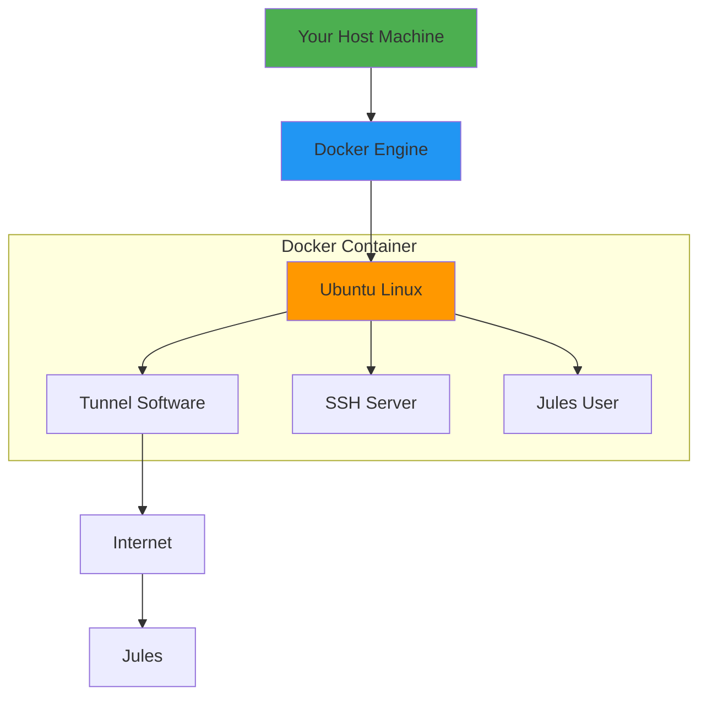
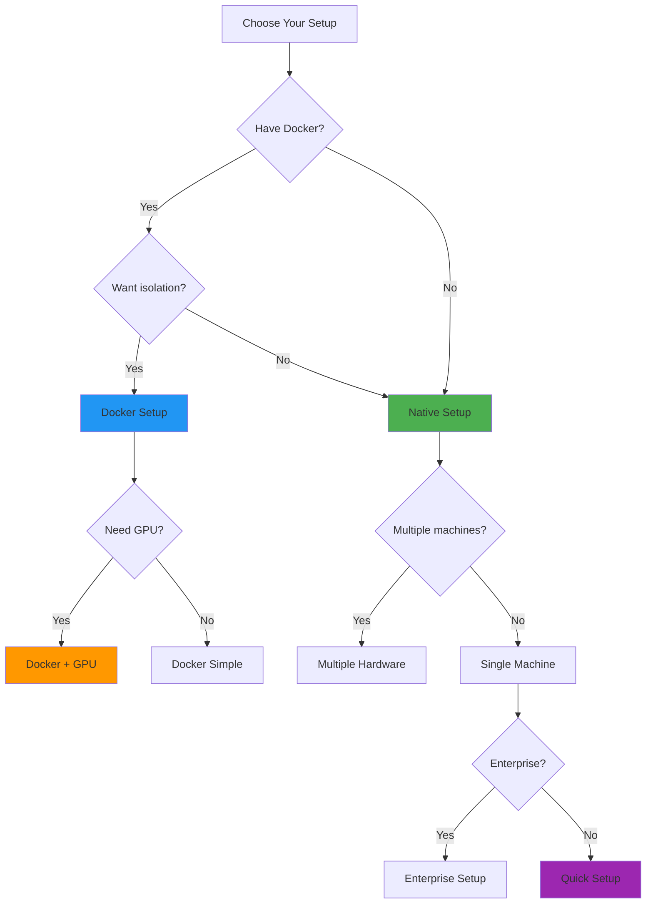

# 🎯 Setup Simplified - Understanding the Building Blocks

**The setup is actually just 3 simple things combined in different ways!**

---

## 🧩 The 3 Building Blocks

### 1. 🌐 Tunnel (Choose One)
**Purpose:** Create a secure public URL to reach your machine

| Option | Best For | Setup Time |
|--------|----------|------------|
| **ngrok** | Quick testing, personal use | 30 seconds |
| **Cloudflare** | Production, custom domains | 2 minutes |
| **Tailscale** | Always-on, mesh network | 2 minutes |

**That's it!** Just a way for Jules to reach your machine from the internet.

---

### 2. 🔐 SSH Server
**Purpose:** Secure way for Jules to run commands

- Creates a `jules` user account
- Sets up SSH key authentication (no passwords)
- Gives Jules sudo access

**That's it!** Just standard SSH like you'd use to connect to any server.

---

### 3. 📝 Connection Files
**Purpose:** Tell Jules how to connect

Generated files:
- `.jules/connection.json` - Connection details
- `.jules/ssh_config` - SSH configuration
- `AGENTS.md` - What Jules can do

**That's it!** Just configuration files Jules reads from your repo.

---

## 🔄 How They Combine


**Every setup scenario is just these 3 blocks in different combinations!**

---

## 🎨 Different Combinations

### Combination 1: Native Installation
```
Your Machine → Install Tunnel → Install SSH → Generate Files → Done
```

**Commands:**
```bash
python jules_setup.py
```

**What happens:**
1. Installs tunnel software (ngrok/Cloudflare/Tailscale)
2. Configures SSH server on your machine
3. Creates jules user
4. Generates connection files

---

### Combination 2: Docker Installation
```
Docker Container → Tunnel Inside → SSH Inside → Generate Files → Done
```

**Commands:**
```bash
cd docker
docker-compose up -d
```

**What happens:**
1. Creates isolated container
2. Tunnel runs inside container
3. SSH server runs inside container
4. Everything isolated from your host

**Why Docker?**
- ✅ Isolated from your main system
- ✅ Same environment everywhere
- ✅ Easy to remove (just delete container)
- ✅ GPU passthrough supported

---

### Combination 3: Multiple Hardware
```
Machine 1 → Tunnel 1 → SSH 1 → Files 1
Machine 2 → Tunnel 2 → SSH 2 → Files 2
Machine 3 → Tunnel 3 → SSH 3 → Files 3
All Files → Your Repo → Jules Chooses
```

**Commands:**
```bash
# On each machine
python jules_setup.py --hardware-name "Machine Name"
```

**What happens:**
1. Each machine gets its own tunnel + SSH
2. Each generates its own connection file
3. All files go in your repo
4. Jules picks which machine to use per task

---

### Combination 4: Enterprise
```
Your Machine → Cloudflare Tunnel → Custom Domain → SSH → Files → Done
```

**Commands:**
```bash
python jules_setup.py --tunnel cloudflare --domain company.com
```

**What happens:**
1. Uses Cloudflare tunnel (enterprise-grade)
2. Custom domain (ssh.company.com)
3. Same SSH setup
4. Same connection files

---

## 🐳 Docker Deep Dive

### Why Docker is Special

**Traditional Setup:**
```
Your OS → Install Software → Configure → Hope it works
```

**Docker Setup:**
```
Any OS → Run Container → Everything pre-configured → Always works
```

### Docker Building Blocks



### Docker Setup Options

#### Option 1: Quick Docker Setup
```bash
cd docker
docker-compose up -d
```

**What you need:**
1. Docker installed
2. Edit `docker-compose.yml`:
   - Add your Cloudflare token
   - Add your SSH public key
3. Run the command

**Time:** 2 minutes

---

#### Option 2: Docker with GPU
```bash
cd docker
# Edit docker-compose.yml - uncomment GPU section
docker-compose up -d
```

**What you need:**
1. NVIDIA GPU
2. NVIDIA Container Toolkit installed
3. Uncomment GPU section in docker-compose.yml
4. Run the command

**Time:** 5 minutes

---

#### Option 3: Docker with Custom Config
```bash
cd docker
# Edit docker-compose.yml with your settings
docker-compose up -d
```

**Customize:**
- Container name
- Port mappings
- Volume mounts
- Environment variables
- Resource limits

---

### Docker vs Native Comparison

| Feature | Docker | Native |
|---------|--------|--------|
| **Isolation** | ✅ Fully isolated | ❌ Shares your system |
| **Cleanup** | ✅ Delete container | ❌ Manual uninstall |
| **GPU Access** | ✅ Passthrough | ✅ Direct |
| **Setup Time** | 2 min | 5 min |
| **Portability** | ✅ Works anywhere | ❌ OS-specific |
| **Performance** | ~95% native | 100% |
| **Security** | ✅ Containerized | ⚠️ Full system access |

---

## 🎯 Decision Tree: Which Combination?



---

## 📋 Setup Cheat Sheet

### I Want: Quick Test
```bash
python jules_setup.py
# Choose ngrok when prompted
```

### I Want: Docker Isolation
```bash
cd docker
# Edit docker-compose.yml (add token & SSH key)
docker-compose up -d
```

### I Want: Docker + GPU
```bash
cd docker
# Edit docker-compose.yml (add token, SSH key, uncomment GPU)
docker-compose up -d
```

### I Want: Production Setup
```bash
python jules_setup.py --tunnel cloudflare --domain company.com
```

### I Want: Multiple Machines
```bash
# On each machine:
python jules_setup.py --hardware-name "Machine Name"
```

### I Want: Full Automation
```bash
python jules_setup.py --repo user/repo --api-key KEY --auto-test
```

---

## 🔍 Understanding the Files

### What `jules_setup.py` Does

```python
# Simplified pseudocode
def jules_setup():
    # Block 1: Tunnel
    tunnel = choose_tunnel()  # ngrok/Cloudflare/Tailscale
    install_tunnel(tunnel)
    start_tunnel()
    
    # Block 2: SSH
    create_jules_user()
    setup_ssh_keys()
    configure_ssh_server()
    
    # Block 3: Connection Files
    generate_connection_json()
    generate_ssh_config()
    generate_agents_md()
    
    # Done!
    print("Jules can now connect!")
```

**That's literally all it does!** Just automates the 3 building blocks.

---

### What Docker Does

```dockerfile
# Simplified Dockerfile
FROM ubuntu:22.04

# Install the 3 blocks
RUN install_tunnel_software()
RUN install_ssh_server()
RUN create_jules_user()

# Start everything
CMD start_tunnel() && start_ssh()
```

**That's it!** Same 3 blocks, just in a container.

---

## 🎓 Mental Model

### Think of it like this:

**Tunnel** = Your front door  
**SSH** = Your security system  
**Connection Files** = The address you give Jules

### Different setups are just:

**Native** = Install in your house  
**Docker** = Install in a separate building  
**Multiple** = Multiple buildings with multiple addresses  
**Enterprise** = Custom street name for your building

---

## 💡 Key Insights

### 1. It's Always the Same 3 Things
No matter which setup you choose, it's always:
- Tunnel (for access)
- SSH (for security)
- Files (for configuration)

### 2. Docker is Just Packaging
Docker doesn't change what's installed, just WHERE it's installed (container vs host).

### 3. All Options Are Combinations
Every setup option is just a different combination of:
- Which tunnel?
- Where to install? (native/Docker)
- How many machines?
- What domain?

### 4. The Script Does Everything
`jules_setup.py` handles all the complexity. You just choose options.

---

## 🚀 Quick Start by Preference

### "I want the simplest thing"
```bash
python jules_setup.py
```
Choose ngrok, done in 2 minutes.

### "I want isolation"
```bash
cd docker && docker-compose up -d
```
Edit 2 lines in docker-compose.yml first.

### "I want GPU access"
```bash
cd docker
# Uncomment GPU section in docker-compose.yml
docker-compose up -d
```

### "I want production-ready"
```bash
python jules_setup.py --tunnel cloudflare --domain company.com
```

### "I want multiple machines"
```bash
# Run on each machine:
python jules_setup.py --hardware-name "Machine Name"
```

---

## 🎯 Summary

**The entire system is just:**

1. **Tunnel** - How Jules reaches you
2. **SSH** - How Jules authenticates
3. **Files** - How Jules knows what to do

**Every setup is just these 3 blocks combined differently!**

- Native = Install on your machine
- Docker = Install in container
- Multiple = Multiple sets of all 3
- Enterprise = Same 3, custom domain

**That's it!** Everything else is just automation and convenience. 🎉

---

**Now you understand the whole system!** Choose your combination and run the setup.
