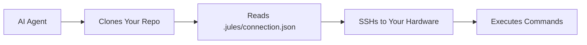

# 🤖 Universal AI Agent Setup

**Using this system with any AI agent (not just Jules)**

---

## 🎯 Overview

While this project is **optimized for Jules** (Google's AI coding agent), the underlying technology works with **any AI agent** that can:

1. Clone git repositories
2. Read JSON configuration files  
3. SSH into remote machines
4. Execute shell commands

---

## ✅ Compatible AI Agents

### Fully Tested
- **Jules** (Google) - Primary focus, fully optimized
- **Claude** (Anthropic) - Works with Code Interpreter
- **GPT-4** (OpenAI) - Works with Advanced Data Analysis

### Should Work (Untested)
- **Cursor** - AI-powered IDE
- **GitHub Copilot** - With workspace access
- **Cody** (Sourcegraph) - With command execution
- **Any custom AI agent** - With SSH capability

---

## 🔧 How It Works

### The Universal Pattern



**Key Point:** The `.jules/` folder contains standard SSH connection info that any agent can use.

---

## 📋 Setup for Different Agents

### For Jules (Primary)

**Setup:**
```bash
python setup.py
./copy-to-project.sh ~/your-project
```

**Jules automatically:**
1. Clones your project
2. Reads `.jules/connection.json`
3. SSHs to your hardware
4. Runs tests/commands

**See:** Main documentation (optimized for Jules)

---

### For Claude (Anthropic)

**Setup:**
```bash
# Same setup process
python setup.py
./copy-to-project.sh ~/your-project
```

**Claude usage:**
```
You: "Clone my project and run tests on my hardware"

Claude: *reads .jules/connection.json*
        *SSHs to your hardware*
        *runs: git clone && cd project && npm test*
```

**Note:** Claude needs explicit instructions to:
1. Read the connection file
2. Use SSH with the provided credentials
3. Execute commands on remote hardware

**Example prompt:**
```
Please:
1. Read .jules/connection.json for SSH connection details
2. SSH into the hardware using those credentials
3. Clone this repository on the hardware
4. Run the test suite
5. Report results
```

---

### For GPT-4 (OpenAI)

**Setup:**
```bash
# Same setup process
python setup.py
./copy-to-project.sh ~/your-project
```

**GPT-4 usage (with Advanced Data Analysis):**
```
You: "Connect to my hardware and run tests"

GPT-4: *reads .jules/connection.json*
       *establishes SSH connection*
       *executes test commands*
```

**Limitations:**
- GPT-4 may need more explicit instructions
- SSH key management might require manual setup
- Less seamless than Jules

**Example prompt:**
```
I have a .jules/connection.json file with SSH details.
Please:
1. Parse the connection details
2. SSH into the remote machine
3. Run: git clone [repo] && cd [repo] && npm test
4. Show me the results
```

---

### For Custom AI Agents

**Setup:**
```bash
# Same setup process
python setup.py
./copy-to-project.sh ~/your-project
```

**Your agent needs to:**

**1. Read connection file:**
```python
import json

with open('.jules/connection.json', 'r') as f:
    config = json.load(f)

hostname = config['ssh_hostname']
username = config['username']
port = config.get('port', 22)
```

**2. Establish SSH connection:**
```python
import paramiko

ssh = paramiko.SSHClient()
ssh.set_missing_host_key_policy(paramiko.AutoAddPolicy())
ssh.connect(
    hostname=hostname,
    username=username,
    key_filename='path/to/private/key',
    port=port
)
```

**3. Execute commands:**
```python
stdin, stdout, stderr = ssh.exec_command('ls -la')
print(stdout.read().decode())
```

**See:** Example implementation in `examples/custom_agent.py`

---

## 📁 Connection File Format

### Standard Format (.jules/connection.json)

```json
{
  "ssh_hostname": "abc123.trycloudflare.com",
  "username": "jules",
  "port": 22,
  "capabilities": ["gpu", "docker", "build"],
  "hardware_name": "GPU Workstation",
  "platform": "linux"
}
```

**Fields:**
- `ssh_hostname` - SSH server hostname
- `username` - SSH username (usually "jules")
- `port` - SSH port (default: 22)
- `capabilities` - Hardware capabilities
- `hardware_name` - Friendly name
- `platform` - OS platform

**Note:** Private SSH key is managed separately by the AI agent.

---

## 🔐 SSH Key Management

### For Jules
Jules manages SSH keys automatically.

### For Other Agents

**Option 1: Agent-Managed Keys**
- Agent stores private key securely
- Agent uses key for SSH authentication

**Option 2: Manual Key Management**
```bash
# Generate key pair
ssh-keygen -t rsa -b 4096 -f ~/.ssh/agent_key

# Add public key during setup
# Use private key with agent
```

**Option 3: SSH Agent**
```bash
# Add key to SSH agent
ssh-add ~/.ssh/agent_key

# Agent uses SSH agent for authentication
```

---

## 🎯 Agent-Specific Considerations

### Jules (Google)
**Pros:**
- ✅ Fully optimized
- ✅ Automatic key management
- ✅ Seamless integration
- ✅ MCP server support

**Cons:**
- None (primary focus)

---

### Claude (Anthropic)
**Pros:**
- ✅ Can read JSON files
- ✅ Can execute SSH commands
- ✅ Good at following instructions

**Cons:**
- ⚠️ Needs explicit instructions
- ⚠️ Manual key management
- ⚠️ Less seamless than Jules

**Best For:**
- One-off tasks
- Explicit workflows
- Supervised execution

---

### GPT-4 (OpenAI)
**Pros:**
- ✅ Advanced Data Analysis mode
- ✅ Can parse JSON
- ✅ Can execute commands

**Cons:**
- ⚠️ Limited SSH support
- ⚠️ May need workarounds
- ⚠️ Less reliable than Jules

**Best For:**
- Simple tasks
- Supervised execution
- Non-critical workflows

---

### Custom Agents
**Pros:**
- ✅ Full control
- ✅ Can optimize for your needs
- ✅ No limitations

**Cons:**
- ⚠️ Requires implementation
- ⚠️ Need to handle SSH
- ⚠️ Need to parse config

**Best For:**
- Specialized workflows
- Enterprise integration
- Custom requirements

---

## 📊 Feature Comparison

| Feature | Jules | Claude | GPT-4 | Custom |
|---------|-------|--------|-------|--------|
| **Auto SSH** | ✅ Yes | ⚠️ Manual | ⚠️ Limited | 🔧 DIY |
| **Key Mgmt** | ✅ Auto | ⚠️ Manual | ⚠️ Manual | 🔧 DIY |
| **MCP Server** | ✅ Yes | ❌ No | ❌ No | 🔧 DIY |
| **Workspace** | ✅ Yes | ⚠️ Limited | ⚠️ Limited | 🔧 DIY |
| **Seamless** | ✅ Yes | ⚠️ Needs prompts | ⚠️ Needs prompts | 🔧 DIY |
| **Reliability** | ✅ High | ⚠️ Medium | ⚠️ Medium | 🔧 Varies |

**Legend:**
- ✅ Fully supported
- ⚠️ Partially supported / needs work
- ❌ Not supported
- 🔧 You implement it

---

## 🚀 Quick Start (Universal)

### Step 1: Setup (Same for All)
```bash
git clone <this-repo>
cd jules-hardware-access
python setup.py
```

### Step 2: Copy to Your Project
```bash
./copy-to-project.sh ~/your-project
```

### Step 3: Agent-Specific Usage

**Jules:**
```
Just tell Jules to work on your project.
Jules handles everything automatically.
```

**Claude:**
```
Prompt: "Read .jules/connection.json, SSH to the hardware,
clone the repo, and run tests. Report results."
```

**GPT-4:**
```
Prompt: "Use the SSH details in .jules/connection.json
to connect to my hardware and run: npm test"
```

**Custom:**
```python
# Implement SSH connection using connection.json
# See examples/custom_agent.py
```

---

## 💡 Tips for Non-Jules Agents

### 1. Be Explicit
```
❌ "Run tests on my hardware"
✅ "Read .jules/connection.json, SSH to hostname, run: npm test"
```

### 2. Provide Context
```
"I have a .jules/ folder with SSH connection details.
The connection.json file has the hostname and username.
Please use these to SSH and run tests."
```

### 3. Break Down Steps
```
1. Read .jules/connection.json
2. Extract ssh_hostname and username
3. SSH to that host
4. Clone the repository
5. Run the test suite
6. Report results
```

### 4. Handle Errors
```
"If SSH fails, check:
- Is the tunnel running?
- Are credentials correct?
- Is the hostname reachable?"
```

---

## 🔧 Troubleshooting

### Agent Can't Read Connection File
**Solution:** Ensure `.jules/connection.json` is in the repository root

### Agent Can't SSH
**Solution:** 
- Check tunnel is running: `python status.py`
- Verify SSH key is available to agent
- Test manually: `ssh username@hostname`

### Agent Doesn't Understand Format
**Solution:** Provide explicit instructions on parsing JSON

### Connection Times Out
**Solution:**
- Check tunnel status
- Verify firewall settings
- Test connection manually

---

## 📚 Examples

### Example 1: Claude Running Tests
```
User: "Please run tests on my hardware"

Claude: "I'll help you run tests on your hardware. Let me:
1. Read the connection details from .jules/connection.json
2. SSH to your hardware
3. Run the test suite

*reads connection.json*
*establishes SSH connection to abc123.trycloudflare.com*
*executes: cd project && npm test*

Results: All 42 tests passed! ✓"
```

### Example 2: GPT-4 Checking Hardware
```
User: "Check my GPU status"

GPT-4: "I'll check your GPU status using the hardware connection.

*reads .jules/connection.json*
*SSHs to hardware*
*runs: nvidia-smi*

Your GPU: NVIDIA RTX 3090
Memory: 24GB
Utilization: 15%
Temperature: 45°C"
```

### Example 3: Custom Agent
```python
# custom_agent.py
import json
import paramiko

# Read connection details
with open('.jules/connection.json') as f:
    config = json.load(f)

# Connect via SSH
ssh = paramiko.SSHClient()
ssh.set_missing_host_key_policy(paramiko.AutoAddPolicy())
ssh.connect(
    hostname=config['ssh_hostname'],
    username=config['username'],
    key_filename='~/.ssh/agent_key'
)

# Run command
stdin, stdout, stderr = ssh.exec_command('npm test')
print(stdout.read().decode())

ssh.close()
```

---

## 🎯 Recommendations

### Use Jules If:
- ✅ You want seamless integration
- ✅ You want automatic everything
- ✅ You want the best experience

### Use Claude If:
- ✅ You need flexibility
- ✅ You're okay with explicit prompts
- ✅ You want good reasoning

### Use GPT-4 If:
- ✅ You're already using OpenAI
- ✅ You need general AI capabilities
- ✅ Hardware access is secondary

### Build Custom If:
- ✅ You have specific requirements
- ✅ You need full control
- ✅ You're integrating with existing systems

---

## 📖 Further Reading

- **[README.md](README.md)** - Main documentation (Jules-focused)
- **[HOW_IT_WORKS.md](HOW_IT_WORKS.md)** - Complete workflow
- **[COMPLETE_WORKFLOW.md](COMPLETE_WORKFLOW.md)** - Full picture
- **[TROUBLESHOOTING.md](TROUBLESHOOTING.md)** - Fix issues

---

**Bottom Line:** This system works with any AI agent, but it's optimized for Jules. Other agents need more explicit instructions but can achieve the same results.

**Recommendation:** Use Jules for the best experience, but know that you're not locked in! 🚀
