# 🔄 User Flows - Visual Guide

## Overview

This document shows the different user flows for setting up Jules hardware access with visual flowcharts for each scenario.

---

## 🚀 Flow 1: Docker Setup (Recommended - Works Everywhere!)

**Best for:** Everyone! Works on Windows, macOS, and Linux

```mermaid
flowchart TD
    A[👤 User starts] --> B[cd docker]
    B --> C[Run: ./setup.sh or setup.ps1]
    C --> D{.env exists?}
    D -->|No| E[Script creates .env template]
    E --> F[User edits .env file]
    F --> G[Add Cloudflare token]
    G --> H[Add SSH public key]
    H --> I[Run setup script again]
    D -->|Yes| J[Validate configuration]
    I --> J
    J --> K{Config valid?}
    K -->|❌ No| L[Show error message]
    L --> F
    K -->|✅ Yes| M[docker-compose up -d --build]
    M --> N[Build Ubuntu container]
    N --> O[Install Cloudflare tunnel]
    O --> P[Configure SSH server]
    P --> Q[Create jules user]
    Q --> R[Start services]
    R --> S[Health check]
    S --> T{Healthy?}
    T -->|✅ Yes| U[Display connection info]
    T -->|❌ No| V[Show logs]
    V --> W[User troubleshoots]
    W --> S
    U --> X[Generate connection files]
    X --> Y[Copy to your project]
    Y --> Z[🎉 Jules can access hardware!]
```



**Time:** 2 minutes  
**Difficulty:** ⭐ Super Easy  
**Commands:** 
- Linux/Mac: `cd docker && ./setup.sh`
- Windows: `cd docker && .\setup.ps1`

**Why Docker First?**
- ✅ Works on ALL platforms (Windows, Mac, Linux)
- ✅ Isolated from your system
- ✅ Easy to remove (just delete container)
- ✅ GPU support included
- ✅ No platform-specific issues

---

## 🖥️ Flow 2: Native Setup (Advanced Users)

**Best for:** Advanced users who want native performance or don't want Docker

```mermaid
flowchart TD
    A[👤 User starts] --> B[Run: python jules_setup.py]
    B --> C{Platform Detection}
    C --> D[✅ Windows/Linux/Mac Detected]
    D --> E[🎯 Interactive Tunnel Wizard]
    E --> F{Choose Tunnel Type}
    F -->|Personal Use| G[🔵 ngrok - Free & Easy]
    F -->|Enterprise| H[🟠 Cloudflare - Custom Domain]
    F -->|Always-On| I[🟢 Tailscale - Mesh Network]
    G --> J[🔐 SSH Configuration]
    H --> J
    I --> J
    J --> K[📝 Generate Connection Files]
    K --> L[✅ Validation Check]
    L --> M{All Tests Pass?}
    M -->|✅ Yes| N[🎉 Success!]
    M -->|❌ No| O[📋 Show Fix Instructions]
    O --> P[User Fixes Issues]
    P --> L
    N --> Q[📁 Files in generated_repo_files/]
    Q --> R[📂 Copy files to your project]
    R --> S[💾 Commit & Push to GitHub]
    S --> T[🤖 Jules can now access hardware!]
```



**Time:** 5-10 minutes  
**Difficulty:** ⭐⭐ Medium  
**Command:** `python jules_setup.py`

**When to use Native:**
- You want 100% native performance
- You don't have/want Docker
- You're comfortable with system-level changes
- You want to customize everything

---

## 🚄 Flow 3: Full Automation with API

**Best for:** Power users who want complete automation

```mermaid
flowchart TD
    A[👤 User starts] --> B[Get Jules API Key]
    B --> C[Run: python jules_setup.py --repo user/repo --api-key KEY --auto-test]
    C --> D[🔍 Auto-detect Everything]
    D --> E[🎯 Setup Tunnel Automatically]
    E --> F[🔐 Configure SSH]
    F --> G[📝 Generate Files]
    G --> H[📁 Add to Repository]
    H --> I[🔗 Create Jules API Session]
    I --> J[🤖 Jules Tests Connection Automatically]
    J --> K{Connection Works?}
    K -->|✅ Yes| L[✅ Auto-create PR with setup]
    K -->|❌ No| M[📧 Email User with Errors]
    L --> N[📬 User gets PR notification]
    N --> O[👀 Review & Merge PR]
    O --> P[🎉 Complete! Jules has access]
```



**Time:** 2-3 minutes  
**Difficulty:** ⭐⭐⭐ Advanced  
**Command:** `python jules_setup.py --repo user/repo --api-key YOUR_KEY --auto-test --auto-pr`

---

## 🏢 Flow 4: Enterprise Setup

**Best for:** Companies, production environments, custom domains

```mermaid
flowchart TD
    A[🏢 Enterprise User] --> B[Prepare Custom Domain]
    B --> C[Run: python jules_setup.py --tunnel cloudflare --domain company.com]
    C --> D[🔐 Cloudflare Account Setup]
    D --> E[🌐 Domain Configuration]
    E --> F[📝 DNS Records Setup]
    F --> G[🔒 SSL Certificate Generation]
    G --> H[🔐 SSH with Custom Domain]
    H --> I[👥 Enterprise Security Settings]
    I --> J[📊 Audit Logging Setup]
    J --> K[👤 Team Access Configuration]
    K --> L[🔍 Security Validation]
    L --> M{Security Check Pass?}
    M -->|✅ Yes| N[✅ Production Ready]
    M -->|❌ No| O[🔧 Fix Security Issues]
    O --> L
    N --> P[🌐 ssh.company.com endpoint]
    P --> Q[🤖 Jules connects via custom domain]
```



**Time:** 15-20 minutes  
**Difficulty:** ⭐⭐⭐ Complex  
**Features:** Custom domain, enterprise security, audit logging, team access

---

## 🖥️ Flow 5: Multiple Hardware Setup

**Best for:** Users with multiple machines (laptop, server, GPU workstation)

```mermaid
flowchart TD
    A[👤 User has multiple machines] --> B[🖥️ Machine 1: Laptop]
    A --> C[🖥️ Machine 2: GPU Server]
    A --> D[🖥️ Machine 3: Cloud VM]
    B --> E[Run: python jules_setup.py --hardware-name Laptop]
    C --> F[Run: python jules_setup.py --hardware-name GPU-Server]
    D --> G[Run: python jules_setup.py --hardware-name Cloud-VM]
    E --> H[📝 Generate laptop.json]
    F --> I[📝 Generate gpu-server.json]
    G --> J[📝 Generate cloud-vm.json]
    H --> K[📁 Collect all connection files]
    I --> K
    J --> K
    K --> L[📂 Add all to .jules/ directory]
    L --> M[📋 Update AGENTS.md with all hardware]
    M --> N[💾 Commit to repository]
    N --> O[🤖 Jules can choose hardware per task]
    O --> P{Task Type?}
    P -->|ML Training| Q[Use GPU-Server]
    P -->|Testing| R[Use Laptop]
    P -->|Production| S[Use Cloud-VM]
```



**Time:** 5 minutes per machine  
**Difficulty:** ⭐⭐ Medium  
**Result:** Jules intelligently selects hardware based on task requirements

---

## 🔧 Flow 6: Troubleshooting

**Best for:** When something goes wrong

```mermaid
flowchart TD
    A[❌ Setup Failed] --> B{What Failed?}
    B -->|Tunnel Issues| C[Run: python tunnel_manager.py status]
    B -->|SSH Issues| D[Run: python validate_jules_setup.py]
    B -->|Connection Issues| E[Run: python test_ai_agent_connection.py]
    C --> F{Tunnel Running?}
    D --> G{SSH Configured?}
    E --> H{Connection Works?}
    F -->|❌ No| I[Check TROUBLESHOOTING.md]
    G -->|❌ No| I
    H -->|❌ No| I
    F -->|✅ Yes| J[Continue to next step]
    G -->|✅ Yes| J
    H -->|✅ Yes| J
    I --> K[📋 Find your error]
    K --> L[🔧 Follow fix instructions]
    L --> M[🔄 Re-run setup]
    M --> N[✅ Fixed!]
    J --> O[✅ All working!]
```



**Tools Available:**
- `python tunnel_manager.py status` - Check tunnel
- `python validate_jules_setup.py` - Validate SSH
- `python test_ai_agent_connection.py` - Test connection
- `TROUBLESHOOTING.md` - Common issues & fixes

---

## ☁️ Flow 7: Cloud Deployment

**Best for:** AWS, Azure, GCP, or other cloud environments

```mermaid
flowchart TD
    A[☁️ Cloud Instance] --> B{Cloud Provider?}
    B -->|AWS| C[EC2 Instance]
    B -->|Azure| D[VM Instance]
    B -->|GCP| E[Compute Instance]
    C --> F[Run: python jules_setup.py --cloud aws]
    D --> G[Run: python jules_setup.py --cloud azure]
    E --> H[Run: python jules_setup.py --cloud gcp]
    F --> I[🔍 Auto-detect cloud environment]
    G --> I
    H --> I
    I --> J[⚙️ Apply cloud-specific optimizations]
    J --> K[🌐 Configure cloud networking]
    K --> L[📊 Set up monitoring]
    L --> M[🔒 Apply cloud security best practices]
    M --> N[✅ Cloud-optimized setup]
    N --> O[🤖 Jules can access cloud hardware]
    O --> P[📈 Auto-scaling ready]
```



**Time:** 5-10 minutes  
**Benefits:** Cloud-optimized, auto-scaling, monitoring included

---

## 🔄 Flow 8: CI/CD Integration

**Best for:** Automated testing in GitHub Actions, GitLab CI, etc.

```mermaid
flowchart TD
    A[📝 Code Push] --> B[🔔 GitHub Action Triggered]
    B --> C[📥 Checkout Code]
    C --> D[⚙️ Setup Hardware Access]
    D --> E[Run: python jules_setup.py --ci-mode]
    E --> F[🔗 Create Jules Test Session]
    F --> G[🤖 Jules Tests on Real Hardware]
    G --> H{Tests Pass?}
    H -->|✅ Yes| I[✅ Merge PR]
    H -->|❌ No| J[❌ Block PR]
    J --> K[📧 Report Issues to Developer]
    K --> L[👨‍💻 Developer Fixes Code]
    L --> M[📝 Push Fix]
    M --> B
    I --> N[🚀 Deploy to Production]
```



**GitHub Actions Example:**
```yaml
name: Test on Hardware
on: [pull_request]
jobs:
  test:
    runs-on: ubuntu-latest
    steps:
      - uses: actions/checkout@v2
      - name: Setup Jules Hardware Access
        run: python jules_setup.py --ci-mode
      - name: Run Tests on Hardware
        run: python jules_test.py --hardware gpu
```

---

## 📊 Flow Comparison Table

| Flow | Time | Difficulty | Platform Support | Best For |
|------|------|------------|------------------|----------|
| **1. Docker Setup** | 2 min | ⭐ Super Easy | Windows/Mac/Linux | Everyone! |
| **2. Native Setup** | 5-10 min | ⭐⭐ Medium | Linux/Mac | Advanced users |
| **3. Full Auto** | 2-3 min | ⭐⭐⭐ Advanced | Linux/Mac | Power users |
| **4. Enterprise** | 15-20 min | ⭐⭐⭐ Complex | Any | Companies |
| **5. Multiple HW** | 2-5 min/machine | ⭐ Easy | Any | Multi-machine |
| **6. Troubleshoot** | Variable | ⭐ Easy | Any | Problem solving |
| **7. Cloud** | 2-5 min | ⭐⭐ Medium | Linux | Cloud deployment |
| **8. CI/CD** | 2 min | ⭐⭐⭐ Complex | Linux | Automation |

---

## 🎯 Decision Tree: Which Flow Should I Use?

```mermaid
flowchart TD
    A[🤔 Which flow should I use?] --> B{First time?}
    B -->|Yes| C[✅ Flow 1: Quick Setup]
    B -->|No| D{Have GitHub repo?}
    D -->|Yes| E{Want automation?}
    D -->|No| C
    E -->|Full automation| F[✅ Flow 3: Full Auto]
    E -->|Some automation| G[✅ Flow 2: With Repo]
    E -->|Manual control| C
    A --> H{Company/Enterprise?}
    H -->|Yes| I[✅ Flow 4: Enterprise]
    A --> J{Multiple machines?}
    J -->|Yes| K[✅ Flow 5: Multiple Hardware]
    A --> L{Something broken?}
    L -->|Yes| M[✅ Flow 6: Troubleshooting]
    A --> N{Cloud deployment?}
    N -->|Yes| O[✅ Flow 7: Cloud]
    A --> P{CI/CD pipeline?}
    P -->|Yes| Q[✅ Flow 8: CI/CD]
```



---

## 🚀 Quick Start Commands

### Flow 1: Docker Setup (RECOMMENDED)
```bash
cd docker
./setup.sh          # Linux/Mac
.\setup.ps1         # Windows PowerShell
```

### Flow 2: Native Setup
```bash
python jules_setup.py
```

### Flow 3: Full Automation
```bash
python jules_setup.py --repo user/repo --api-key YOUR_KEY --auto-test --auto-pr
```

### Flow 4: Enterprise
```bash
python jules_setup.py --tunnel cloudflare --domain company.com
```

### Flow 5: Multiple Hardware
```bash
# Docker (easiest - works everywhere):
cd docker && ./setup.sh  # Run on each machine

# Or native:
python jules_setup.py --hardware-name "Machine Name"
```

### Flow 6: Troubleshooting
```bash
# Docker:
docker-compose logs -f
docker-compose exec jules-agent /healthcheck.sh

# Native:
python tunnel_manager.py status
python validate_jules_setup.py
python test_ai_agent_connection.py
```

### Flow 7: Cloud
```bash
# Docker (recommended):
cd docker && ./setup.sh

# Or native:
python jules_setup.py --cloud aws  # or azure, gcp
```

### Flow 8: CI/CD
```bash
python jules_setup.py --ci-mode
```

---

## 💡 Tips for Success

1. **Start Simple**: Use Flow 1 (Quick Setup) if you're new
2. **Test First**: Always run validation after setup
3. **Read Instructions**: Check `generated_repo_files/INSTRUCTIONS.md`
4. **Keep Keys Safe**: Never commit private SSH keys
5. **Use Dedicated Hardware**: VM or separate machine recommended
6. **Check Logs**: If issues occur, check tunnel and SSH logs
7. **Update Regularly**: Keep tunnel software updated

---

## 📚 Related Documentation

- **[README.md](README.md)** - Project overview
- **[GETTING_STARTED.md](GETTING_STARTED.md)** - Detailed setup guide
- **[AGENTS.md](AGENTS.md)** - For Jules to read
- **[TROUBLESHOOTING.md](TROUBLESHOOTING.md)** - Fix common issues
- **[QUICK_REFERENCE.md](QUICK_REFERENCE.md)** - All commands

---

**Choose your flow and get started!** 🎉
