# 🎨 Visual Overview

A complete visual guide to the Jules Hardware Access ecosystem.

---

## 🏗️ System Architecture

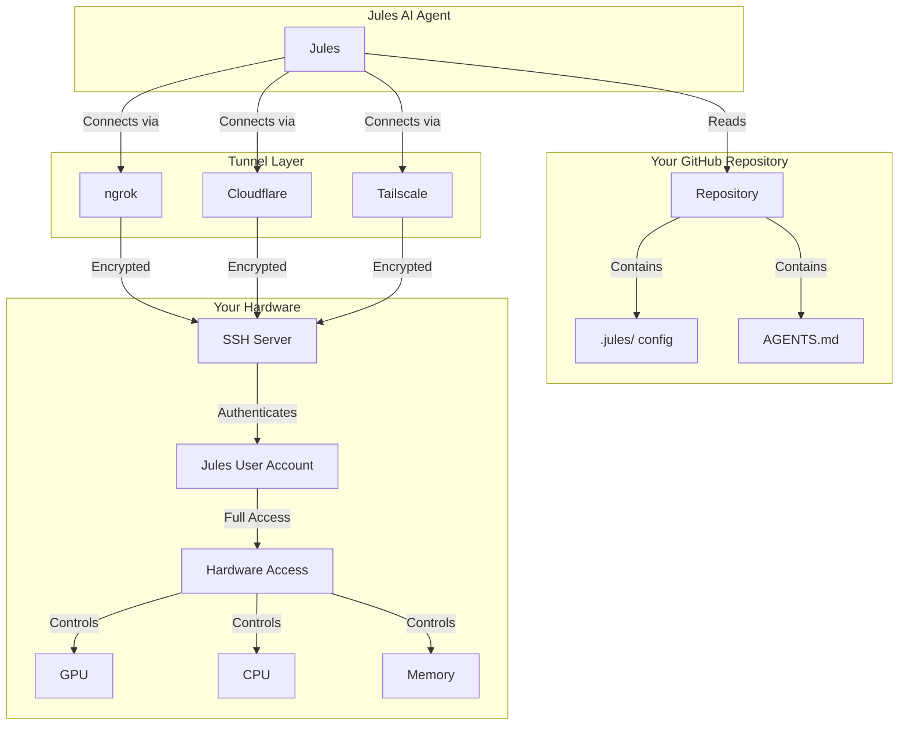

---

## 🔄 Setup Flow

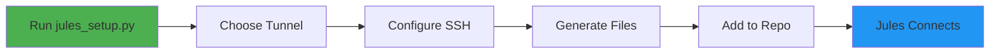

---

## 📁 File Generation

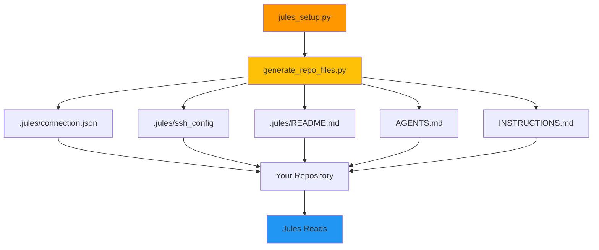

---

## 🔐 Security Layers

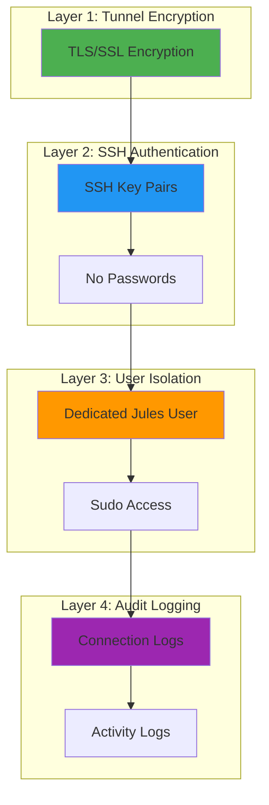

---

## 🌐 Tunnel Options Comparison

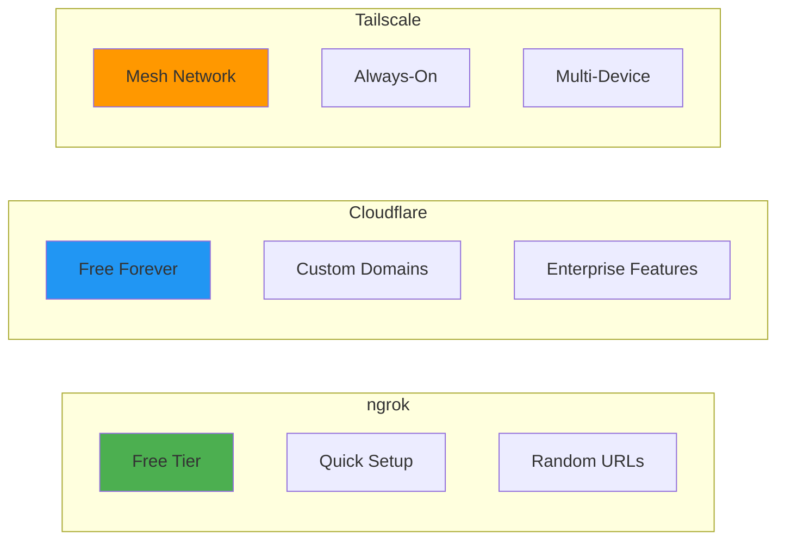

---

## 🖥️ Hardware Access Map

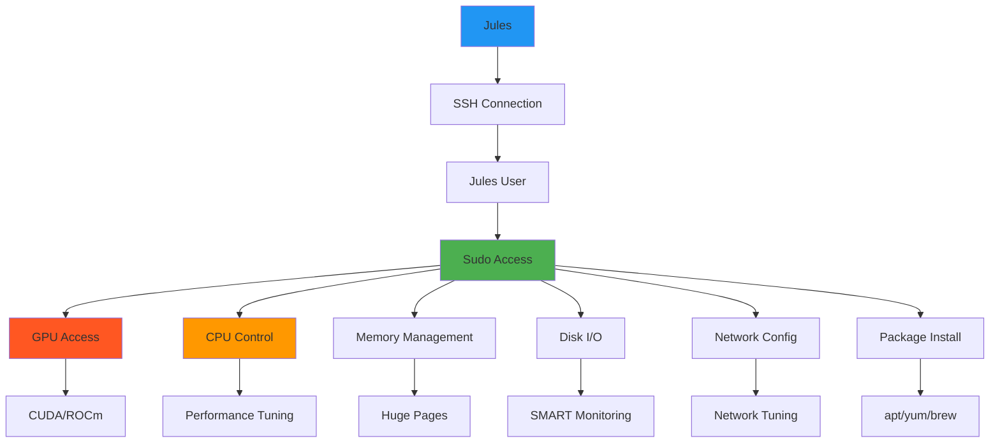

---

## 📊 User Journey Map

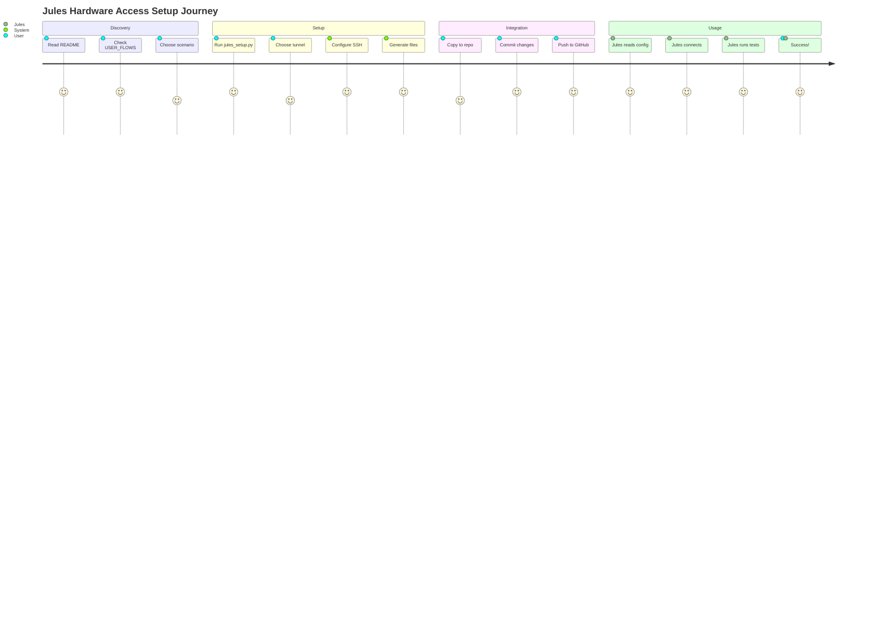

---

## 🔄 Connection Flow

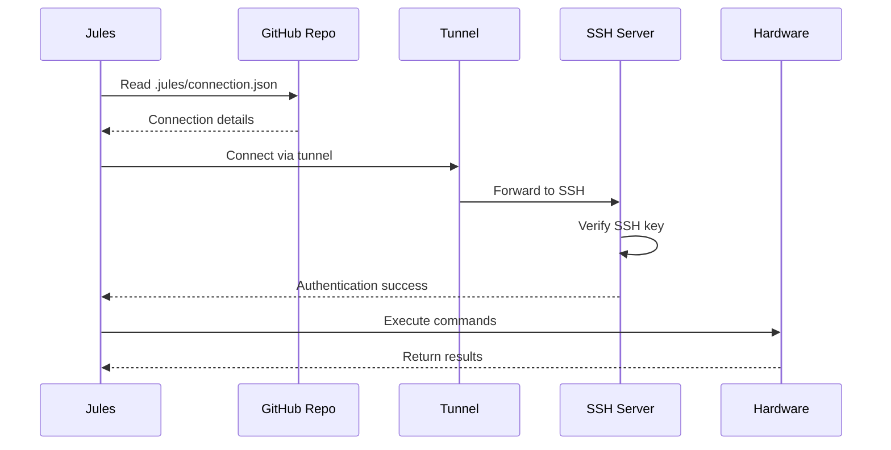

---

## 🎯 Decision Tree

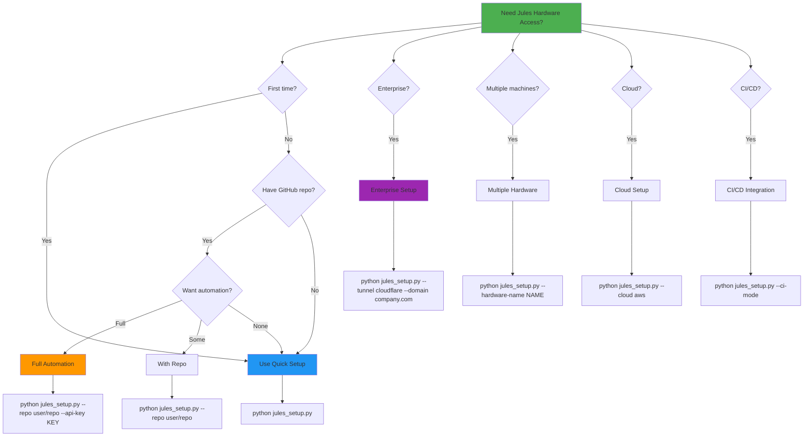

---

## 📦 Component Interaction

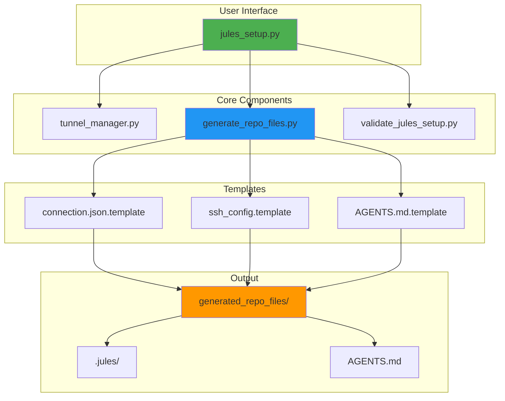

---

## 🔍 Troubleshooting Flow

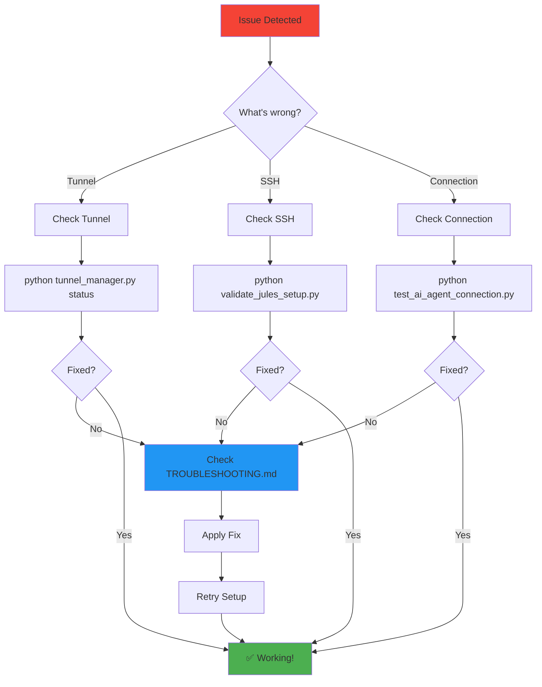

---

## 🌟 Feature Matrix

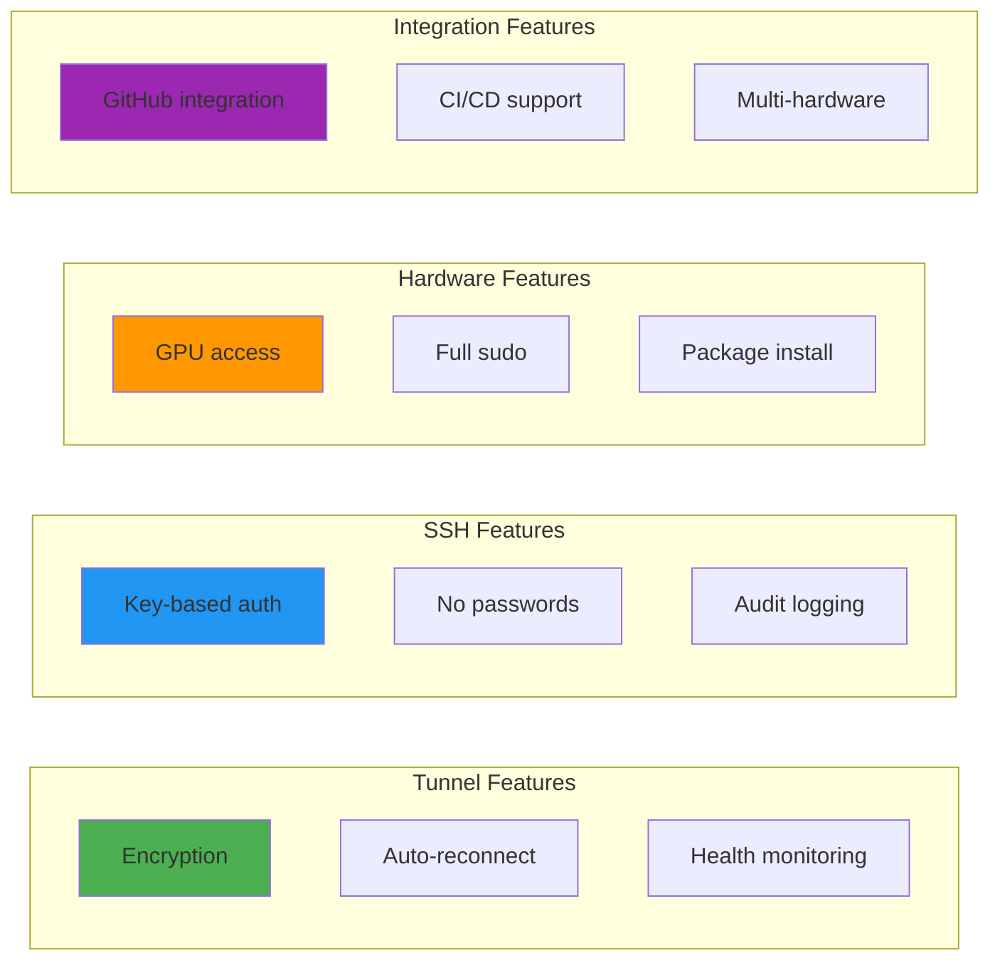

---

## 📈 Scalability Model

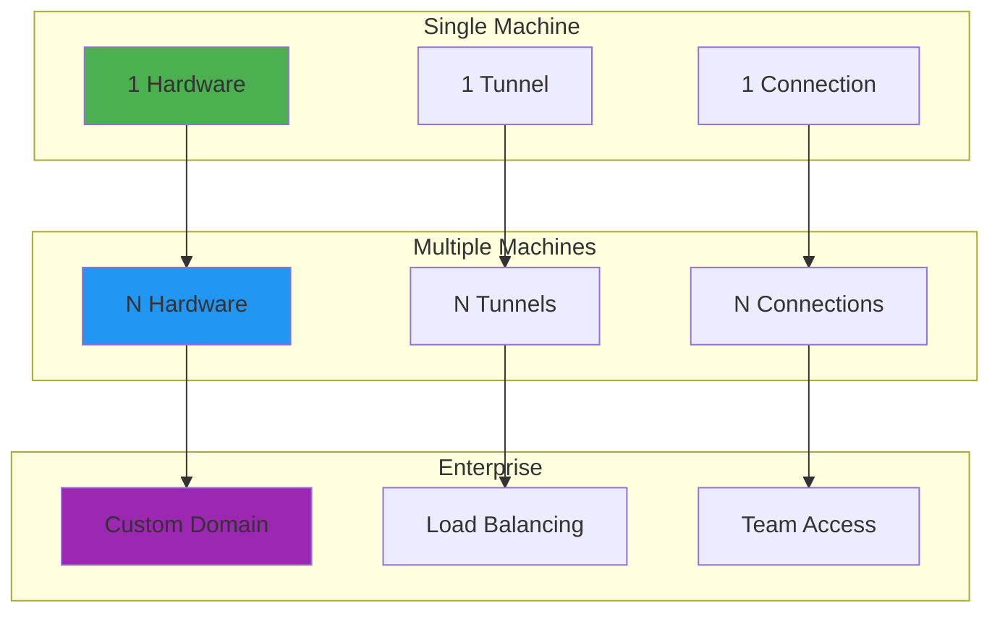

---

## 🎓 Learning Path

---

## 🔄 Continuous Operation

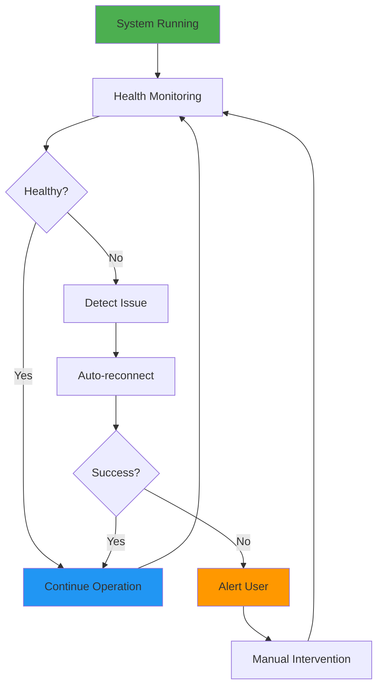

---

## 📊 Metrics Dashboard

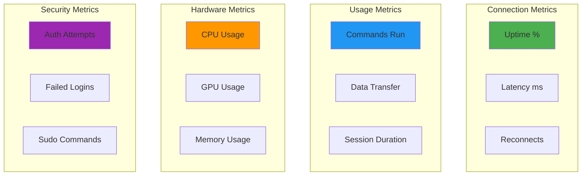

---

**Visual guides for every aspect of Jules Hardware Access!** 🎨
